# claude-station

A local dashboard for driving Claude Code across several repos at once — FE, BE, iOS/Swift,
Android/Kotlin, KMP — plus the daily Jira/Excel/GitHub chores. Everything runs on your machine:
a Node server owns the PTYs and the Claude sessions, the browser is just the UI.

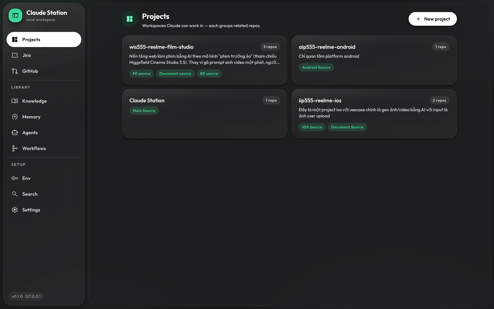

## Quick start

```sh
npm install
cp .env.example .env
npm run dev
```

The server prints the URL to open:

```
  claude-station ready
  → http://127.0.0.1:5173/?t=09c5042c…
```

Open it once; the token goes into `localStorage` and the address bar is cleaned up. Put a fixed
`CLAUDE_STATION_TOKEN` in `.env` if you want it to survive reinstalls — otherwise one is generated
and kept in `data/.token`.

The token is not optional. The API spawns shells and runs build commands, so it is remote code
execution by design, and binding to `127.0.0.1` alone would not help: any page open in your browser
can POST to localhost. Every request needs the token **and** a whitelisted `Origin`.

**Requirements:** Node 24+ · `claude` CLI already logged in (the Agent SDK reuses that login, no API
key needed) · Xcode Command Line Tools on macOS (node-pty builds against them) · `tmux` for terminals
that survive a restart and can be handed to Terminal.app (`brew install tmux`; without it terminals
still work, they just die with the server) · optional `gh` CLI for the GitHub views.

## What it does

### Projects

Group the repos that belong together. Each path gets a label and a description, and the description
is what Claude reads to tell your backend from your iOS app. `~` and relative paths are accepted.
Leaving a project keeps its terminals alive; the sidebar brings you back to the one you were in.

### Claude, in a real terminal

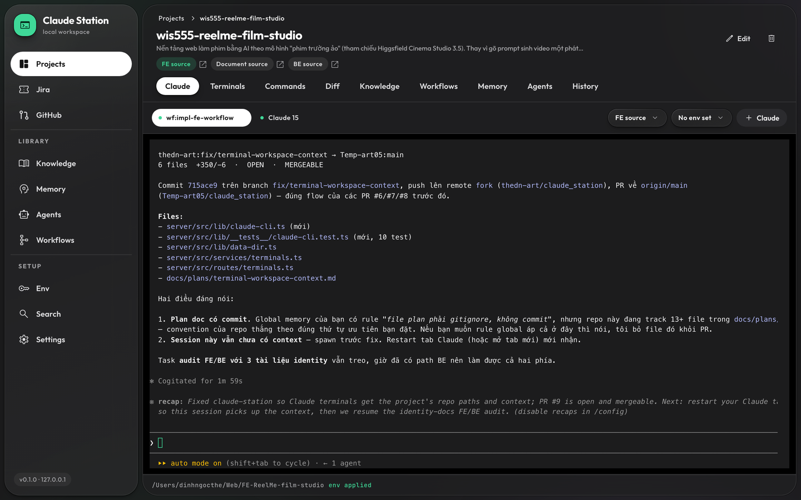

Each repo gets embedded `claude` CLI terminals — a real PTY rendered with xterm, so the CLI's own
TUI handles approvals exactly as it does in your shell. Scrollback survives a reconnect.

Every terminal runs inside a tmux session on the app's own socket (`tmux -L claude-station`), which
buys two things. It **survives a server restart** — the tab goes *detached* and **Reattach** picks the
session up mid-thought instead of starting over. And **Open in Terminal** hands the session to a real
window: the launcher attaches to the very same tmux session, so it is the same process and the same
conversation, and the tab here lets go. Closing a tab with **×** is still a real kill; only the
hand-off detaches. Terminal app is a setting (`Terminal` by default), and `npm run tmux:ls` /
`npm run tmux:prune` show and clean up sessions nothing points at any more.

**History** in the tab bar has two parts. First the app's own sessions: the ones you closed, plus
the ones left over from an earlier server process — a tab is only a session something still has
(running, or detached with its tmux session alive). Then **From the CLI**: every `claude`
conversation the CLI itself remembers for this project's directories, *including the ones you ran
in a real terminal and this app never saw*. Continuing one opens a tab that adopts its session id,
so from then on it is an ordinary session here. They are read straight off
`~/.claude/projects/` — head and tail of each file only, never the whole thing, since a
conversation with pasted images can run to tens of MB. Each Claude tab owns its own CLI session
id (`claude --session-id`), so continuing one resumes *that* conversation — `claude --continue` would
have picked whichever conversation in the directory was newest, which is the wrong one as soon as two
tabs share a repo. The trash icon on a row deletes it for good: the row **and** the CLI's transcript
under `~/.claude/projects/`, with no confirmation and no undo — in the CLI section it deletes the
transcript even if that conversation is running in another terminal right now, which is why each
row shows when it was last written to. Rows opened before session ids existed
still continue via `--continue`, and deleting one only drops the row — nothing on disk is guessed at.

Two tmux details worth knowing: the prefix is `C-]` (not `C-b`, which readline needs), and the mouse
is tmux's — the wheel scrolls tmux history since tmux owns the alternate screen, so selecting text
needs Option/Shift. Without tmux installed the terminals fall back to plain PTYs and the hand-off
button is gone. Jira and GitHub both have a
"Work on this with Claude" button that opens one of these with the issue context pre-typed — never
auto-sent. Agent workspaces and workflow steps use the Agent SDK chat instead, with streaming and an
approval modal.

### Commands

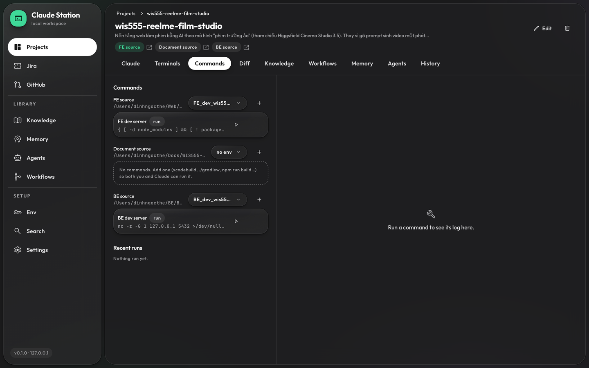

Per-path build/test/lint runner — `xcodebuild`, `./gradlew`, `npm run …` — with a live log, a
timeout, and a kill that takes the whole process group. Presets for iOS / Android / KMP / Node.
Claude can run these too (and read the logs), so it can fix a failing build on its own. The second
button on a command runs it in a terminal window instead, same cwd and same env set — that run is
yours, not the app's: no log, no timeout, no kill button.

### Diff

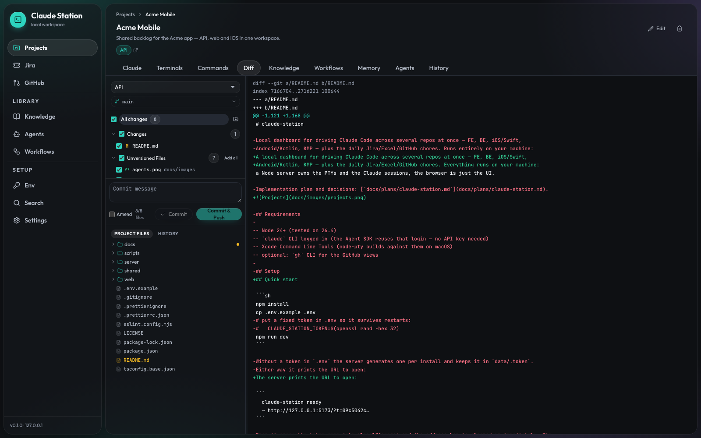

git status and diff per path, with changelists, unversioned files, inline editing, discard,
commit and push. Live-refreshes as files change on disk. A session can optionally take its own git
worktree so two agents never share a working tree.

### Workflows

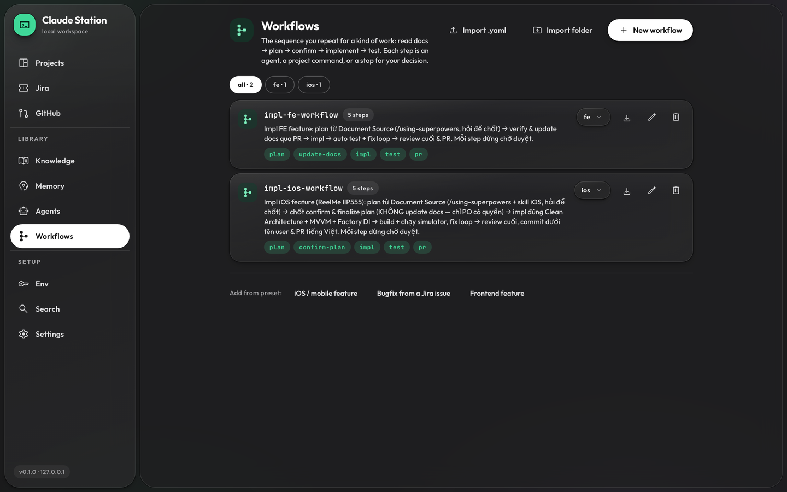

The sequence you repeat for a kind of work — read docs → plan → confirm → update docs → implement →
test — stored as a library asset you import into projects. Each step is an agent, a project command,
or a stop for your decision, and each sets its own permission mode: a long implement step can run
unattended while the planning step still asks.

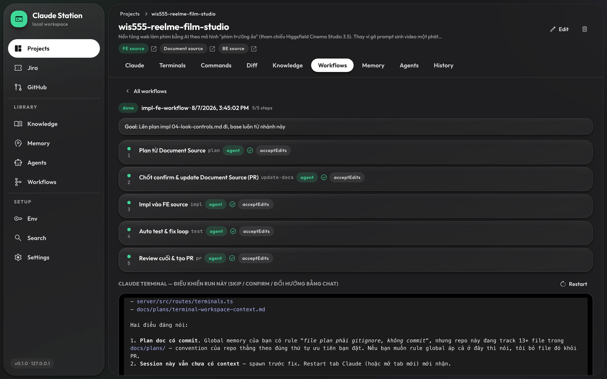

A run shows every step's state and the goal it was started with, over the Claude terminal driving it —
which you can talk to mid-run to skip, confirm or redirect a step. An agent pauses the run by calling
`workflow_ask`; you answer on the run view and later steps receive those answers. Artifacts (plans,
reports) are downloadable per step. A restart marks the in-flight step interrupted rather than
re-running it blind.

### Agents

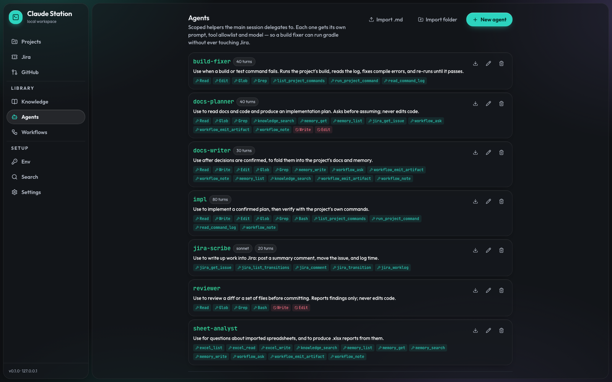

Subagents the main session can delegate to, each with its own prompt, tool allowlist, model alias
and turn cap — so a build fixer can run gradle without ever touching Jira. Enable one globally or
per project. Imports and exports `.agent.md`, so they stay portable to plain Claude Code.

An agent can also be a whole app rather than a prompt: import a folder with a `start.sh` and it gets
a workspace tab that runs it and embeds its own UI above the terminal.

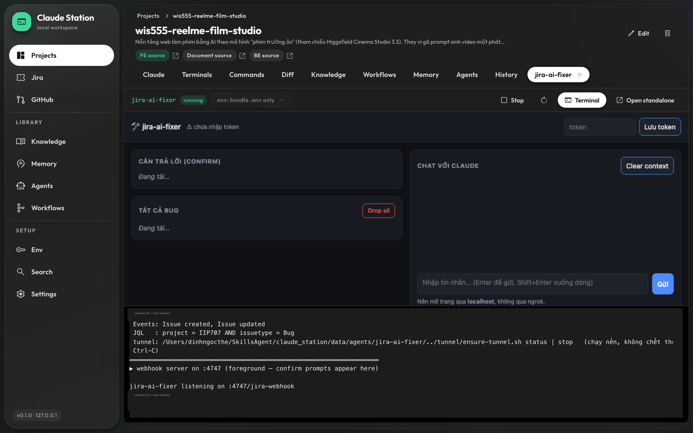

Above is `jira-ai-fixer` — a webhook server that picks up Jira bugs labelled `AI-Fix`, fixes them
with headless Claude Code, opens the PR and reports back. Start / stop and the env set it runs with
are in the tab's toolbar; the terminal stays in the foreground so a fix that needs your confirmation
can ask for it there. (The webhook URL and token in the terminal are redacted in this screenshot.)

### Env sets

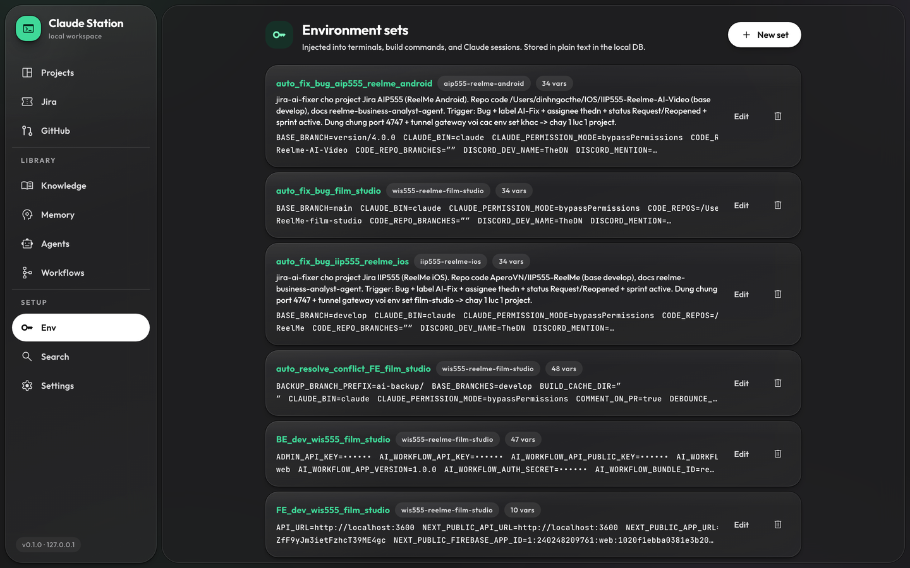

Global or per project, injected into terminals, build commands and Claude sessions. Values marked
secret are masked in the UI.

### Knowledge

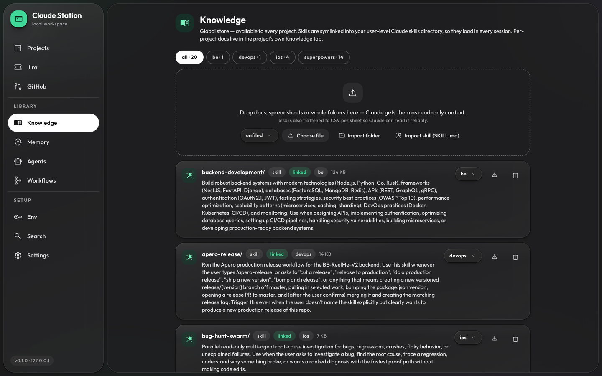

Docs and spreadsheets per project, or a global library organised in folders and attached to projects
by reference — the file is stored once and several projects can read it. `.xlsx` is flattened to CSV
per sheet so Claude reads it reliably, whole folders can be dropped in at once, and skills are
symlinked into `~/.claude/skills` so they load in every session, not just here.

### Memory

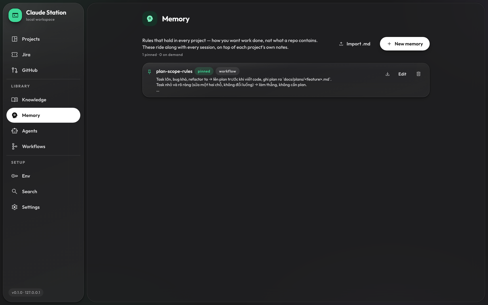

Conventions, decisions and gotchas that aren't in the code. Claude writes these as it works — when
you correct it, when a decision is settled, when a gotcha costs it time — and reads them next
session. Global notes apply to every project, on top of each project's own. Pinned notes go into the
prompt in full; the rest are titles Claude fetches on demand.

### GitHub

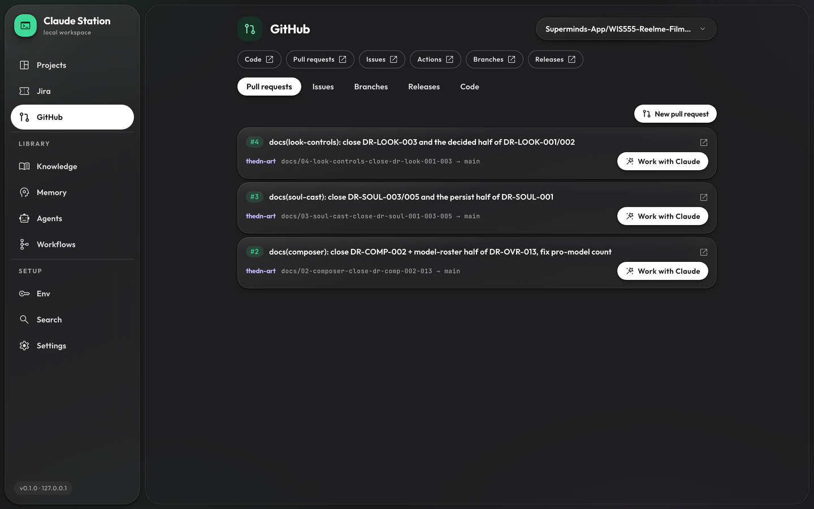

PRs, issues, branches, releases and a read-only file browser, all through your existing `gh` login —
no token to paste. Open a PR to review it in place:

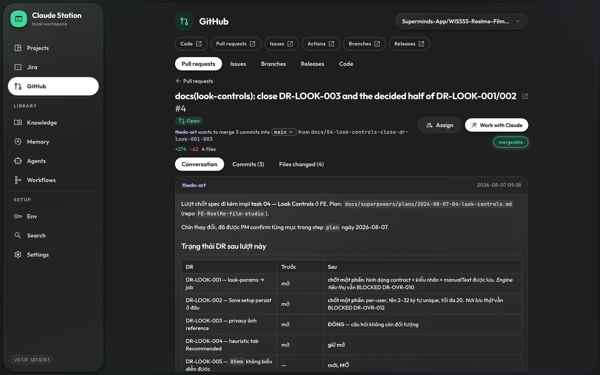

Conversation, commits and the diff; approve or request changes, assign, toggle draft, change base,
merge (squash / merge / rebase) or close. "Work with Claude" hands the whole PR context to a Claude
terminal in the matching project.

### Jira

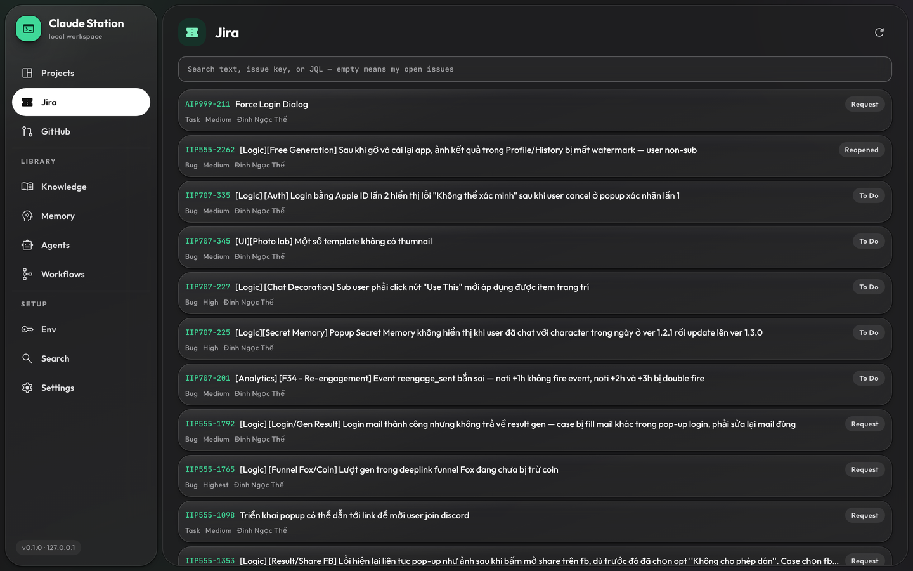

Cloud and self-hosted (Server/DC, Bearer PAT, API v2): my-issues plus any JQL, ADF→markdown detail,
and comment / transition / log work without leaving the app. Every issue has the same
"work on this with Claude" hand-off.

### Settings

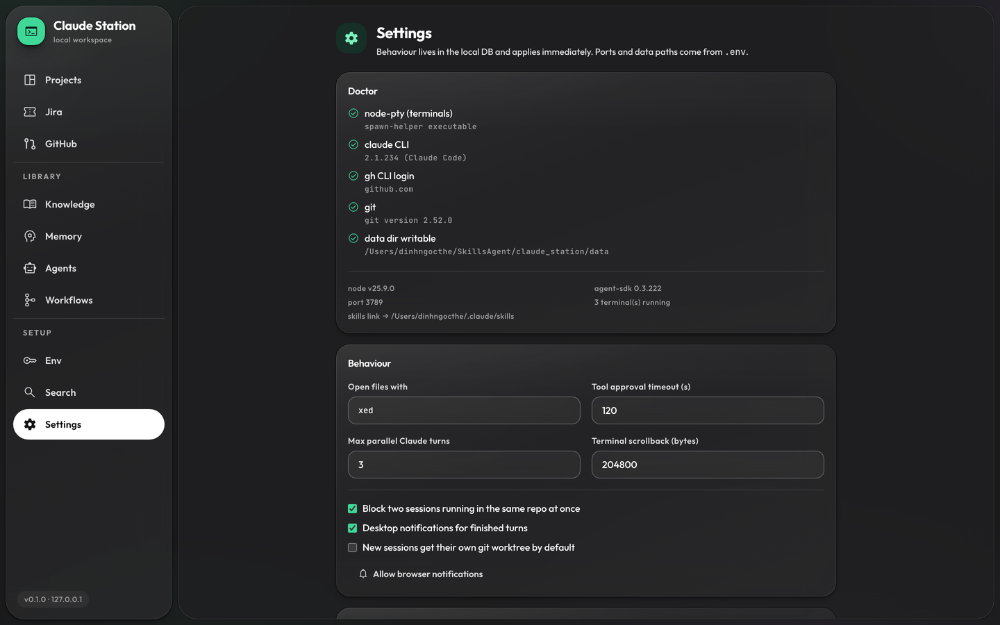

Behaviour that applies everywhere — approval timeout, parallel-turn cap, repo lock, IDE command, log
tail sizes, worktree default — plus the Jira/GitHub credentials, a Doctor that checks versions, the
`claude` login, PTY health and data-dir writability, and a whole-app export/import for moving the
station to another machine.

### And the rest

|                              |                                                                                                                                                                                                                                                                    |
| ---------------------------- | ------------------------------------------------------------------------------------------------------------------------------------------------------------------------------------------------------------------------------------------------------------------ |
| **Claude's own tools** (MCP) | `jira_*`, `excel_*`, `knowledge_search`, `list_project_commands`, `run_project_command`, `read_command_log`, `memory_*`. Every mutating call goes through the approval modal, except memory writes — those are this app's own notes, reviewable in the Memory tab. |
| **Search**                   | SQLite FTS5 across chat history and imported knowledge.                                                                                                                                                                                                            |
| **History**                  | Audit feed of everything the app and Claude did, per project.                                                                                                                                                                                                      |

## Where things live

Everything the app manages sits in `<repo>/data/` (gitignored), so deleting the repo leaves nothing
behind:

```
data/claude-station.db      SQLite (projects, sessions, messages, runs, settings)
data/.token                 API token, chmod 600
data/knowledge/<projectId>  per-project docs and spreadsheets
data/knowledge/global       the shared asset library
data/skills/<name>          skill sources (symlinked into ~/.claude/skills)
data/logs/<runId>.log       full build logs
data/worktrees/<sessionId>  per-session git checkouts
```

A session's worktree is removed when the session is archived or deleted. If one ever outlives its
session — a database import is the usual way — boot clears it out, because git keeps an orphan's
branch checked out and that branch can then be neither switched to nor deleted. A worktree with
uncommitted work is never removed automatically; it is logged instead, and the branch popup offers
to release it once you say so.

Move it with `CLAUDE_STATION_DATA`. The only path written outside the repo is the skills symlink,
because that is where Claude Code looks for user-level skills (`CLAUDE_SKILLS_DIR` to change it).

## Configuration

| Layer          | Where                                | Examples                                                                                           |
| -------------- | ------------------------------------ | -------------------------------------------------------------------------------------------------- |
| Infrastructure | `.env`, read at boot                 | `PORT`, `WEB_PORT`, `STATION_HOST`, `CLAUDE_STATION_DATA`, `CLAUDE_SKILLS_DIR`, `MCP_TOOL_TIMEOUT` |
| Behaviour      | Settings page → `app_settings` table | approval timeout, parallel-turn cap, repo lock, IDE command, log tail sizes, worktree default      |
| Per project    | project detail → DB                  | repo paths, labels, descriptions, build/test commands, env sets                                    |

### Local domain

`http://localhost:5173` is a poor address for something you keep open all day. On macOS, one setup
gives it a real one:

```sh
sudo npm run setup:host      # → http://claude.station
```

It adds a `/etc/hosts` alias for `127.0.0.1`, and a pf rule redirecting port 80 on loopback to the
dev server — that is what removes the port from the URL without running Vite as root. A launchd job
reloads the rule at boot. Then set `STATION_HOST=claude.station` in `.env` so the server whitelists
the new Origin and prints the matching token link.

Nothing becomes reachable from the network: the alias points at loopback and the server still binds
to `127.0.0.1`.

The alias then becomes the only way in. While the redirect is installed, `http://127.0.0.1:5173` and
`http://localhost:5173` stop answering: pf owns that port as its redirect target, and reverse-
translates the replies of a direct connection as if they belonged to a redirected one. Vite still
prints its own `http://127.0.0.1:5173/` line at startup — ignore it and use the URL the server
prints. `sudo npm run teardown:host` gives the direct address back.

Two things worth knowing. Port 80 can only point at one place, and the default is the dev server —
for `npm start` instead, run `sudo bash scripts/setup-host.sh --port 3789`. And a major macOS
upgrade can reset `/etc/pf.conf`; re-running the setup fixes it, the script is idempotent. Undo it
all with `sudo npm run teardown:host`.

## Platform support

macOS is the developed-and-tested platform. Linux works — the only gaps are native notifications
(macOS-only) and the `ide.command` default, which is `xed` and should be changed to `code`.
Windows is **not** supported natively: terminals assume a POSIX shell, the command runner relies on
process groups, and the skills feature needs symlinks. Use WSL2.

## Scripts

```sh
npm run dev         # server (tsx watch) + vite
npm run check       # typecheck + eslint + vitest
npm run build       # build the web app
npm start           # production, single port
npm run db:generate # regenerate drizzle migrations after a schema change
npm run fix:pty     # re-apply +x on node-pty's spawn-helper

sudo npm run setup:host     # macOS: serve the UI at http://claude.station
sudo npm run teardown:host  # remove it again
```

## Troubleshooting

**Terminals fail with `posix_spawnp failed`.** npm can skip dependency install scripts
(`allow-scripts`), and node-pty's `spawn-helper` then keeps its non-executable bit. `npm run fix:pty`
re-applies it; `postinstall` runs it automatically. Settings → Doctor reports this as a failed PTY
check.

**401, or the UI asks for a token.** The browser is holding a stale token — the value in `.env`
changed, or `data/.token` was regenerated. Reopen the URL the server printed, or paste the token in.

**"Another session is already working in this repo."** Two Claude sessions must not write the same
working tree. Wait, or create the session with _own git worktree_ checked — it gets its own checkout
under `data/worktrees/`.

---

Implementation notes and decisions: [`docs/plans/`](docs/plans/).
