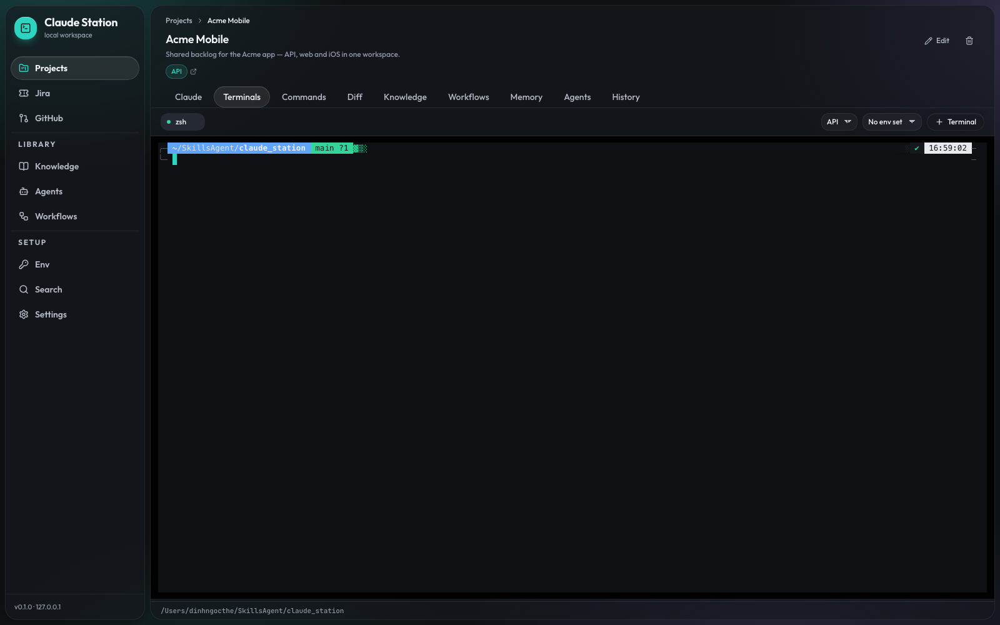

# claude-station

A local dashboard for driving Claude Code across several repos at once — FE, BE, iOS/Swift,
Android/Kotlin, KMP — plus the daily Jira/Excel/GitHub chores. Everything runs on your machine:
a Node server owns the PTYs and the Claude sessions, the browser is just the UI.


## Quick start

```sh
npm install
cp .env.example .env
npm run dev
```

The server prints the URL to open:

```
  claude-station ready
  → http://127.0.0.1:5173/?t=09c5042c…
```

Open it once; the token goes into `localStorage` and the address bar is cleaned up. Put a fixed
`CLAUDE_STATION_TOKEN` in `.env` if you want it to survive reinstalls — otherwise one is generated
and kept in `data/.token`.

The token is not optional. The API spawns shells and runs build commands, so it is remote code
execution by design, and binding to `127.0.0.1` alone would not help: any page open in your browser
can POST to localhost. Every request needs the token **and** a whitelisted `Origin`.

**Requirements:** Node 24+ · `claude` CLI already logged in (the Agent SDK reuses that login, no API
key needed) · Xcode Command Line Tools on macOS (node-pty builds against them) · optional `gh` CLI
for the GitHub views.

## What it does

### Projects

Group the repos that belong together. Each path gets a label and a description, and the description
is what Claude reads to tell your backend from your iOS app. `~` and relative paths are accepted.

### Claude, in a real terminal



Each repo gets embedded `claude` CLI terminals — a real PTY rendered with xterm, so the CLI's own
TUI handles approvals exactly as it does in your shell. Scrollback survives a reconnect, and a
restart after a server restart resumes with `claude --continue`. Jira and GitHub both have a
"Work on this with Claude" button that opens one of these with the issue context pre-typed — never
auto-sent. Agent workspaces and workflow steps use the Agent SDK chat instead, with streaming and an
approval modal.

### Commands


Per-path build/test/lint runner — `xcodebuild`, `./gradlew`, `npm run …` — with a live log, a
timeout, and a kill that takes the whole process group. Presets for iOS / Android / KMP / Node.
Claude can run these too (and read the logs), so it can fix a failing build on its own.

### Diff


git status and diff per path, with changelists, unversioned files, inline editing, discard,
commit and push. Live-refreshes as files change on disk. A session can optionally take its own git
worktree so two agents never share a working tree.

### Workflows


The sequence you repeat for a kind of work — read docs → plan → confirm → update docs → implement →
test — stored as a library asset you import into projects. Each step is an agent, a project command,
or a stop for your decision, and each sets its own permission mode: a long implement step can run
unattended while the planning step still asks. An agent pauses the run by calling `workflow_ask`;
you answer on the run view and later steps receive those answers. Artifacts (plans, reports) are
downloadable per step. A restart marks the in-flight step interrupted rather than re-running it blind.

### Agents


Subagents the main session can delegate to, each with its own prompt, tool allowlist, model alias
and turn cap — so a build fixer can run gradle without ever touching Jira. Enable one globally or
per project. Imports and exports `.agent.md`, so they stay portable to plain Claude Code.

### Env sets


Global or per project, injected into terminals, build commands and Claude sessions. Values marked
secret are masked in the UI.

### And the rest

| | |
|---|---|
| **Jira** | Cloud and self-hosted (Server/DC, Bearer PAT, API v2): my-issues + JQL, ADF→markdown detail, comment / transition / log work from the UI. |
| **GitHub** | PRs, issues, branches, releases and a read-only file browser through your existing `gh` login. |
| **Knowledge** | Docs and spreadsheets per project, or a global library organised in folders and attached to projects by reference. `.xlsx` is flattened to CSV per sheet so Claude reads it reliably. Skills are symlinked into `~/.claude/skills`. |
| **Claude's own tools** (MCP) | `jira_*`, `excel_*`, `knowledge_search`, `list_project_commands`, `run_project_command`, `read_command_log`, `memory_*`. Every mutating call goes through the approval modal. |
| **Project memory** | Conventions, decisions and gotchas that aren't in the code. Pinned notes go into every session prompt in full; the rest are titles Claude fetches on demand. |
| **Search** | SQLite FTS5 across chat history and imported knowledge. |
| **History / Doctor** | Audit feed of everything the app and Claude did; versions, login state, PTY health and data-dir writability. |

## Where things live

Everything the app manages sits in `<repo>/data/` (gitignored), so deleting the repo leaves nothing
behind:

```
data/claude-station.db      SQLite (projects, sessions, messages, runs, settings)
data/.token                 API token, chmod 600
data/knowledge/<projectId>  per-project docs and spreadsheets
data/knowledge/global       the shared asset library
data/skills/<name>          skill sources (symlinked into ~/.claude/skills)
data/logs/<runId>.log       full build logs
data/worktrees/<sessionId>  per-session git checkouts
```

Move it with `CLAUDE_STATION_DATA`. The only path written outside the repo is the skills symlink,
because that is where Claude Code looks for user-level skills (`CLAUDE_SKILLS_DIR` to change it).

## Configuration

| Layer | Where | Examples |
|---|---|---|
| Infrastructure | `.env`, read at boot | `PORT`, `WEB_PORT`, `CLAUDE_STATION_DATA`, `CLAUDE_SKILLS_DIR`, `MCP_TOOL_TIMEOUT` |
| Behaviour | Settings page → `app_settings` table | approval timeout, parallel-turn cap, repo lock, IDE command, log tail sizes, worktree default |
| Per project | project detail → DB | repo paths, labels, descriptions, build/test commands, env sets |

## Platform support

macOS is the developed-and-tested platform. Linux works — the only gaps are native notifications
(macOS-only) and the `ide.command` default, which is `xed` and should be changed to `code`.
Windows is **not** supported natively: terminals assume a POSIX shell, the command runner relies on
process groups, and the skills feature needs symlinks. Use WSL2.

## Scripts

```sh
npm run dev         # server (tsx watch) + vite
npm run check       # typecheck + eslint + vitest
npm run build       # build the web app
npm start           # production, single port
npm run db:generate # regenerate drizzle migrations after a schema change
npm run fix:pty     # re-apply +x on node-pty's spawn-helper
```

## Troubleshooting

**Terminals fail with `posix_spawnp failed`.** npm can skip dependency install scripts
(`allow-scripts`), and node-pty's `spawn-helper` then keeps its non-executable bit. `npm run fix:pty`
re-applies it; `postinstall` runs it automatically. Settings → Doctor reports this as a failed PTY
check.

**401, or the UI asks for a token.** The browser is holding a stale token — the value in `.env`
changed, or `data/.token` was regenerated. Reopen the URL the server printed, or paste the token in.

**"Another session is already working in this repo."** Two Claude sessions must not write the same
working tree. Wait, or create the session with *own git worktree* checked — it gets its own checkout
under `data/worktrees/`.

---

Implementation notes and decisions: [`docs/plans/`](docs/plans/).
